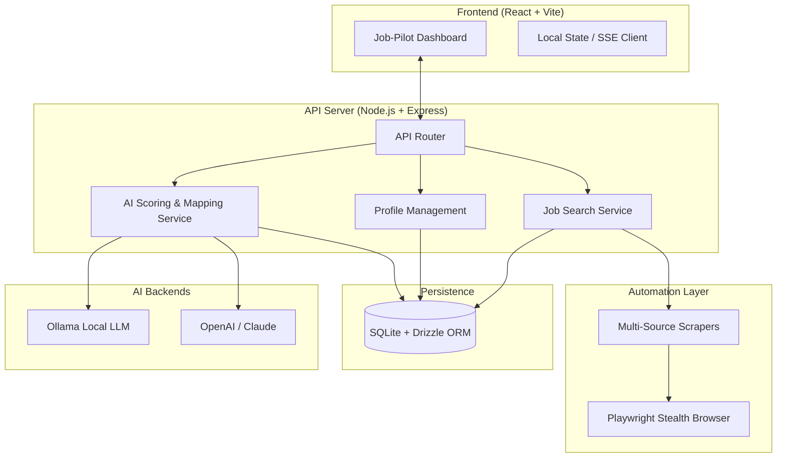

# 🚀 Job-Pilot: AI-Powered Job Discovery Pipeline

Job-Pilot is a high-performance, automated job search and application suite. It leverages AI (Ollama, OpenAI, Claude) to discover, rank, and auto-fill job applications across multiple platforms like LinkedIn, Indeed, and Naukri.

## 🏗️ System Architecture

Job-Pilot follows a modular architecture designed for speed, stealth, and resilience.



## 🔄 Data Flow

### 1. Job Discovery Flow
1. **Trigger**: User enters a role and region in the UI.
2. **Orchestration**: `JobSearchService` spawns multiple scrapers (LinkedIn, Indeed, etc.) in parallel.
3. **Extraction**: Scrapers use **Playwright Stealth** to navigate and parse job listings.
4. **Persistence**: Found jobs are deduplicated and saved to the SQLite database.
5. **Streaming**: Real-time progress and job results are streamed to the UI via **Server-Sent Events (SSE)**.

### 2. AI Scoring Flow
1. **Trigger**: User clicks "Score Jobs" or search finishes.
2. **Context Building**: Backend retrieves the user's profile and CV text from the DB.
3. **Sequential Processing**: Jobs are sent one-by-one to the selected AI backend (to avoid LLM rate limits/crashes).
4. **Analysis**: AI calculates a **Match Score** and provides a **Match Reason** based on skills and experience.
5. **Update**: Scores are saved to the DB and pushed to the UI.

### 3. Auto-Fill Flow
1. **Mapping**: AI analyzes the job description and the user's CV to create a field-by-field mapping (`Name` -> `Value`).
2. **Injection**: Playwright navigates to the application URL and injects the mapped data into the form fields.
3. **Review**: The user reviews the mapped fields in the UI before final submission.

## 🛠️ Technology Stack

| Layer | Technologies |
| :--- | :--- |
| **Frontend** | React 19, TypeScript, Vite, Vanilla CSS (Premium Aesthetics) |
| **Backend** | Node.js, Express, TypeScript |
| **Database** | SQLite, Drizzle ORM, better-sqlite3 |
| **Automation** | Playwright, playwright-stealth |
| **AI** | Ollama (local), OpenAI API, Claude API |
| **DevOps** | Batch scripting (`run.bat`), pnpm |

## 🚀 Getting Started

### Prerequisites
- Node.js (v18+)
- pnpm
- Ollama (optional, for local AI)

### Installation
1. Clone the repository.
2. Run `pnpm install` in the root.
3. Configure your `.env.local` in the root (API keys for OpenAI/Claude).

### Running the App
Use the provided launcher to start both the API server and the Frontend:
```bash
run.bat
```
- **Frontend**: http://localhost:5173
- **API Server**: http://localhost:3005

## 📂 Project Structure
- `artifacts/jobpilot`: Frontend application source.
- `artifacts/api-server`: Backend Express server and scrapers.
- `lib/db`: Shared database schema and Drizzle configuration.
- `run.bat`: Unified process manager (handles port cleanup and startup).

---
*Built with ❤️ for elite job hunters.*
