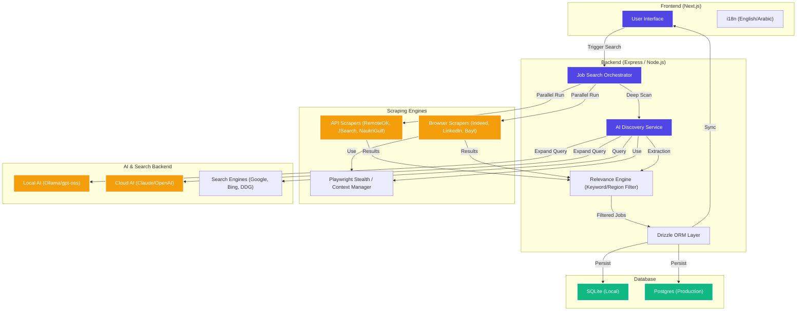

# 🚀 JobPilot v2.0

**JobPilot** is a high-performance, AI-powered hybrid job discovery engine designed to eliminate the friction of searching for roles across fragmented platforms. It combines structured API feeds, resilient browser-based scrapers, and an autonomous AI Discovery pipeline to find jobs that traditional search engines miss.

---

## ✨ Key Features

- **🔍 Hybrid Discovery Pipeline**: Parallel execution of API scrapers (RemoteOK, JSearch, NaukriGulf), browser scrapers (Indeed, LinkedIn, Bayt), and AI-driven web searches.
- **🤖 AI-Powered Role Expansion**: Uses local AI (Ollama) or Cloud AI (Claude/OpenAI) to expand search queries into semantic variations (e.g., "Agentic AI" → "Autonomous Agent Engineer", "LLM Specialist").
- **🌍 Region-Aware Intelligence**: Specialized logic for **Gulf/MENA** (UAE, Saudi Arabia, Qatar) and **India** markets, auto-injecting regional portals like NaukriGulf, Bayt, and GulfTalent.
- **🛡️ CAPTCHA Resilience**: Automated detection and Human-In-The-Loop (HITL) fallback for Bing, Google, and LinkedIn search challenges.
- **⚡ Performance Optimized**: Reduced discovery latency with intelligent session reuse and parallel task execution.
- **📊 Unified Persistence**: Deduplicates and stores jobs in a searchable SQLite/Postgres database via Drizzle ORM.
- **🎯 Location-Drift Prevention**: Strict geographic filtering to ensure results stay relevant to your target region.

---

## 🏗️ Architecture



- **Frontend**: Next.js (App Router) with Tailwind CSS and Internationalization.
- **Backend**: Node.js (Express) with TypeScript.
- **Database**: Drizzle ORM with Better-SQLite3 (local) or Postgres (cloud).
- **Scraping**: Playwright Stealth with intelligent context management.
- **AI Engine**: Ollama (local gpt-oss) / Claude API / OpenAI API.

---

## 🛠️ Pre-requisites

Before you begin, ensure you have the following installed:

1.  **Node.js**: v18.0.0 or higher.
2.  **pnpm**: Recommended package manager (`npm install -g pnpm`).
3.  **Ollama** (Optional but recommended): For local AI discovery. [Download Ollama](https://ollama.com/).
    - Pull the default model: `ollama pull llama3` (or your preferred model).
4.  **Playwright Browsers**: To run the browser-based scrapers.

---

## 🚀 Getting Started

### 1. Clone the Repository
```bash
git clone https://github.com/mohd98zaid/Job-Pilot.git
cd Job-Pilot
```

### 2. Install Dependencies
```bash
pnpm install
```

### 3. Environment Setup
Create a `.env.local` file in the root (and in `artifacts/api-server`) with the following:
```env
# AI Backend Configuration
AI_BACKEND=Ollama # or Claude / OpenAI
OLLAMA_MODEL=gpt-oss:120b-cloud
CLAUDE_API_KEY=your_key_here

# Database
DATABASE_URL=file:./jobpilot.db

# Scraper Settings
HEADLESS=true
```

### 4. Initialize Database
```bash
pnpm run init-db
```

### 5. Install Playwright Browsers
```bash
npx playwright install chromium
```

### 6. Run the Application
Start the backend and frontend in development mode:
```bash
# Root directory
pnpm dev
```

---

## 🔧 Maintenance Commands

- **Update Graph**: `graphify update .` (to keep the knowledge graph current).
- **Typecheck**: `pnpm run typecheck`.
- **Database Studio**: `npx drizzle-kit studio`.

---

Built with ❤️ by [Mohd Zaid](https://github.com/mohd98zaid).

---

<div align="center">
  <strong>⭐ Star this repo if you find it useful!</strong>
</div>
